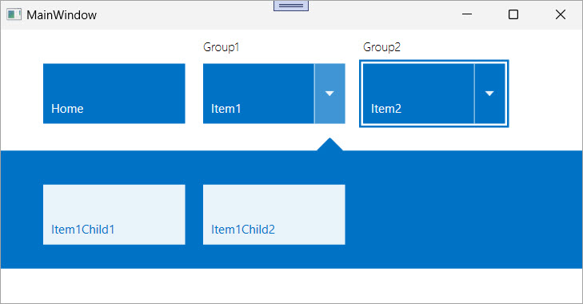

<!-- default badges list -->

[](https://supportcenter.devexpress.com/ticket/details/T148752)
[](https://docs.devexpress.com/GeneralInformation/403183)
[](#does-this-example-address-your-development-requirementsobjectives)
<!-- default badges end -->

# WPF TileBar – Bind Items to a ViewModel Collection (MVVM)

The [`TileBar`](https://documentation.devexpress.com/WPF/115595/Controls-and-Libraries/Navigation-Controls/Tile-Bar) control allows you to create a Windows 10-inspired navigation UI. 



Use the `TileBar` control with MVVM when you need to:

- Define a dynamic navigation UI based on data rather than hard-coded items.
- Bind a `TileBar` to a flat or hierarchical data structure.
- Apply styles, group headers, commands, and flyout content from your data model.

## Implementation Details

### Data Structure

The `ViewModel` exposes an `ObservableCollection<Item>` as the `Items` property. Each `Item` defines the following:

- A `Name` property that defines the tile's label.
- An optional `Group` string to group tiles visually.
- A collection of `Children` (if present) to populate the flyout.
- A `Command` that runs when the item is clicked.

```csharp
public class Item : BindableBase {
    public string Name { get; set; }
    public string Group { get; set; }
    public ObservableCollection<Item> Children { get; set; }
    public bool IsHasChildren => Children != null && Children.Count > 0;
    public DelegateCommand Command { get; }
}
```

### Item Styling and Grouping

The following code example uses the `ItemContainerStyle` property to configure tile appearance and behavior:

```xaml
<Style TargetType="{x:Type dxnav:TileBarItem}" x:Key="TileBarItemStyleBase">
    <Setter Property="Content" Value="{Binding Name}" />
    <Setter Property="Command" Value="{Binding Command}" />
</Style>

<Style TargetType="{x:Type dxnav:TileBarItem}" BasedOn="{StaticResource TileBarItemStyleBase}" x:Key="TileBarItemStyleExtended">
    <Setter Property="dxnav:TileBar.GroupHeader" Value="{Binding Group}" />
    <Style.Triggers>
        <DataTrigger Binding="{Binding IsHasChildren}" Value="true">
            <Setter Property="FlyoutContent" Value="{Binding Children}" />
            <Setter Property="FlyoutContentTemplate">
                <Setter.Value>
                    <DataTemplate>
                        <dxnav:TileBar
                            ItemsSource="{Binding}"
                            ItemContainerStyle="{StaticResource TileBarItemStyleBase}"
                            ItemColorMode="Inverted" />
                    </DataTemplate>
                </Setter.Value>
            </Setter>
        </DataTrigger>
    </Style.Triggers>
</Style>
```

### TileBar Configuration

The [`TileBar`](https://documentation.devexpress.com/WPF/115595/Controls-and-Libraries/Navigation-Controls/Tile-Bar) control is bound to the `Items` collection and uses the extended style:

```xaml
<dxnav:TileBar
    ItemsSource="{Binding Items}"
    ItemContainerStyle="{StaticResource TileBarItemStyleExtended}" />
```

## Files to Review

* [MainWindow.xaml](./CS/TBExample/MainWindow.xaml) (VB: [MainWindow.xaml](./VB/TBExample/MainWindow.xaml))
* [MainWindow.xaml.cs](./CS/TBExample/MainWindow.xaml.cs) (VB: [MainWindow.xaml.vb](./VB/TBExample/MainWindow.xaml.vb))

## Documentation

* [TileBar](https://documentation.devexpress.com/WPF/115595/Controls-and-Libraries/Navigation-Controls/Tile-Bar)
* [TileBarItem](https://documentation.devexpress.com/#WPF/clsDevExpressXpfNavigationTileBarItemtopic)
* [TileBarItem.FlyoutContentTemplate](https://documentation.devexpress.com/WPF/DevExpress.Xpf.Navigation.TileBarItem.FlyoutContentTemplate)

## More Examples

* [WPF TileNavPane – Display Navigation Buttons and Categories](https://github.com/DevExpress-Examples/wpf-tilenavpane-display-nav-buttons-and-categories)
* [WPF Tiles – Create Windows-Inspired Tile Layout](https://github.com/DevExpress-Examples/wpf-create-tile-layout-control)
* [WPF MVVM Behaviors – Display Theme Selectors Based on BarItems](https://github.com/DevExpress-Examples/wpf-mvvm-behaviors-barItems-based-theme-selectors)
* [WPF Dock Layout Manager – Merge Bars in Controls That Support Automatic Merging](https://github.com/DevExpress-Examples/wpf-docklayoutmanager-merge-bars-in-controls-that-support-automatic-merging)

<!-- feedback -->
## Does this example address your development requirements/objectives?

[](https://www.devexpress.com/support/examples/survey.xml?utm_source=github&utm_campaign=wpf-tilebar-generate-items-from-view-model-collection&~~~was_helpful=yes) [](https://www.devexpress.com/support/examples/survey.xml?utm_source=github&utm_campaign=wpf-tilebar-generate-items-from-view-model-collection&~~~was_helpful=no)

(you will be redirected to DevExpress.com to submit your response)
<!-- feedback end -->
